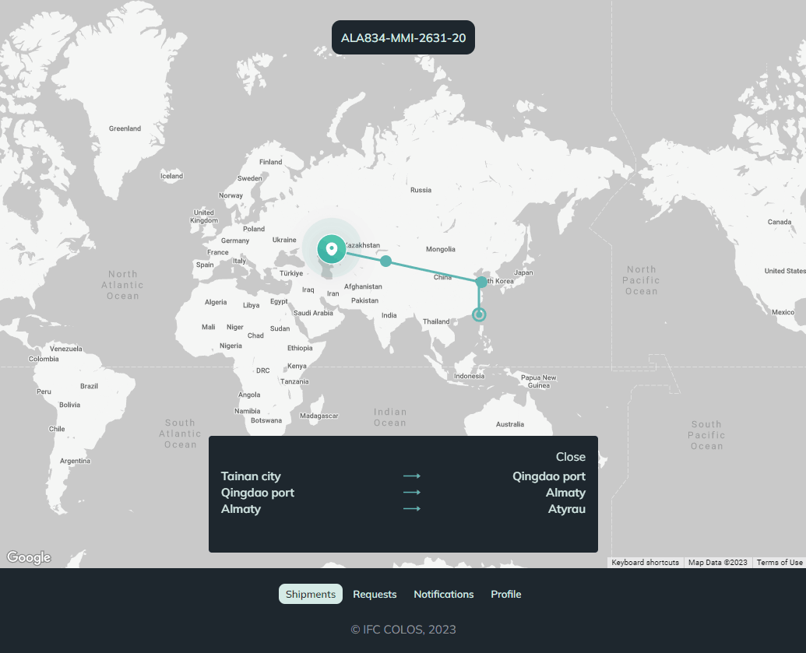

  

## About app

COLOS is an application for your shipments tracking. There are different roles in app such as a dispatch operator, regular user, and project client. The functionality for each role has been limited or expanded depending on the role. Each shipment can be tracked on a map with an accurate location calculation and movement history

## 🛠 App languages
Mobile app: Dart and flutter 
Backend: php 
Web app: Vue.js

## Features
- Google maps polyline drawing and custom icons

## Google maps polyline drawing and custom icons

All Google maps integration you can find in [example](./code_examples)

  

